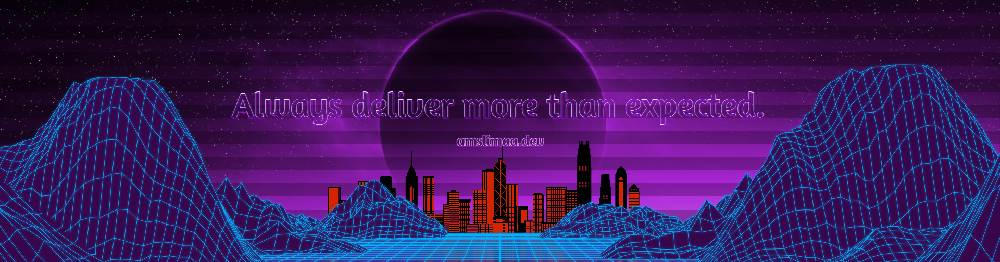

# Hi  , I'm Amós Lima  

<em>Computer Science Student at <a style="color:#861f95" href="https://www.ufpi.br/">Federal University of Piauí  </a> Focused on learning <a style="color:#861f95" href="https://www.freecodecamp.org/">Free code camp</a> ,
<a style="color:#861f95" href="https://www.rocketseat.com.br/">Rocketseat</a>
 
</em>

 

## Technologies

 
 

<!-- - I’m currently working on ... -->

 

### How to contact me:

<!--  --> 

<!-- links to your social media accounts -->

[1]: https://twitter.com/amslimaa
[2]: https://github.com/amslimaa
[3]: https://www.linkedin.com/in/amslimaa/

<!-- Resources -->
<!-- Icons: https://simpleicons.org/ -->
<!-- GitHub Stats: https://github.com/anuraghazra/github-readme-stats -->
<!-- Emojis: https://emojipedia.org/emoji/ -->
<!-- HTML Emojis: https://www.fileformat.info/index.htm -->
<!-- GIFS: https://media.giphy.com -->
<!-- Shields: https://shields.io/ -->
<!-- Awesome GitHub Profile README: https://github.com/abhisheknaiidu/awesome-github-profile-readme -->